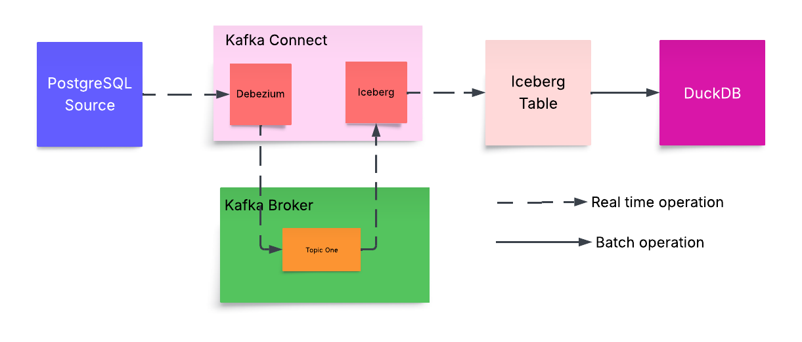

# Real-Time Data Platform Playground

This repository is a demo environment for experimenting with a real-time data platform using PostgreSQL, Kafka, Apache Iceberg, and DuckDB. It is designed for learning, prototyping, and testing data engineering workflows involving streaming and analytical data processing.

## Stack



- **PostgreSQL**: Relational database for transactional data.
- **Kafka**: Distributed event streaming platform.
- **Apache Iceberg**: High-performance table format for huge analytic datasets.
- **DuckDB**: In-process analytical database for ad-hoc queries.
- **Kafka Connect**: For integrating data between Kafka and other systems.
- **MinIO**: S3-compatible object storage for data lake storage.

## Features

- End-to-end data pipeline from PostgreSQL to Iceberg via Kafka.
- Example connectors and scripts for data ingestion and querying.
- Local development with Docker Compose.

## Getting Started

### Prerequisites

- [Docker](https://www.docker.com/)
- [Docker Compose](https://docs.docker.com/compose/)

### Setup

1. **Clone the repository:**
   ```sh
   git clone https://github.com/svishal9/real-time-data-platform-playground.git
   cd real-time-data-platform-playground
   ```

2. **Start the data platform:**
   ```sh
   ./go.sh start
   ```

3. **Stop the data platform and retain data:**
   ```sh
   ./go.sh stop
   ```
   
4. **Select all rows from the Iceberg table via DuckDB:**
   ```sh
   ./go.sh query
   ```

### Directory Structure

- `connect-plugins/`: Kafka Connect plugins (e.g., Debezium Postgres source, Iceberg sink).
- `connect-config/`: Configuration files for Kafka Connect connectors.
- `scripts/`: Helper scripts to manage the environment.
- `docker-compose.yml`: Service definitions for the stack.
- `pg_init/`: PostgreSQL initialization scripts.

## Usage

- Use PostgreSQL as a source for streaming data.
- Kafka acts as the events transfer and storage backbone.
- Iceberg tables are managed and queried for analytics.
- KSQL can be used for stream processing and transformations.
- Schema Registry can be used to manage data schemas.
- MinIO provides object storage for Iceberg data.
- Kafka Connect is used to connect PostgreSQL to Kafka and Iceberg.
- DuckDB can be used for ad-hoc analysis on Iceberg data.

## Cleaning Up

To stop all services and clean up data:
```sh
./go.sh delete
```

## License

This project is for demo purposes.
